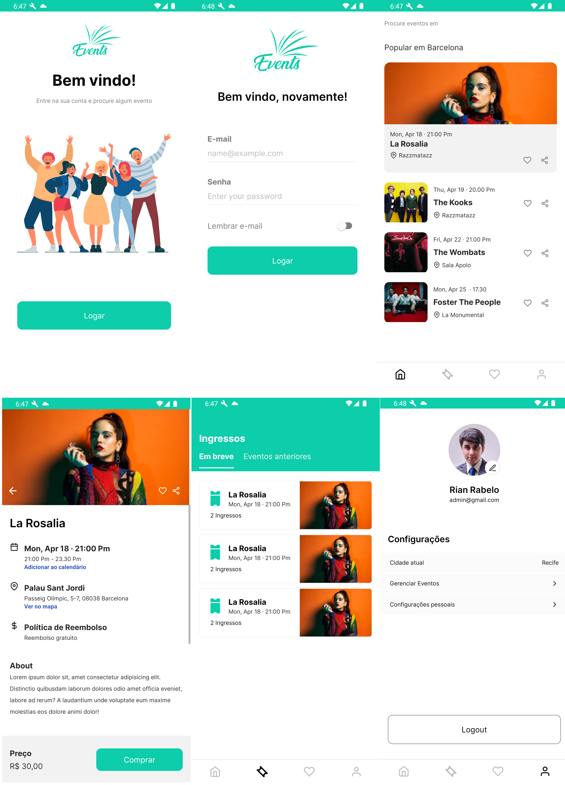

## Desafio Front End Mobile MBLabs

O desafio tem como objetivo avaliar a pessoa candidata nas experiências: 
* Criação de layouts
* Padrões no uso do React Native
* Boas práticas de programação e organização de projeto

### Aplicativo Criado ( Imagens do aplicativo em funcionamento )

## Requisitos
Estou procurando uma empresa para desenvolver um app de gestão de eventos, a ideia é ter algo que as pessoas possam utilizar para buscar e comprar ingressos para eventos de empresas e universidades.

### Obrigatório
- Styled-Components  ✅
- Redux ✅
- AsyncStorage ✅
- TypeScript ✅
- React Navigation ✅
